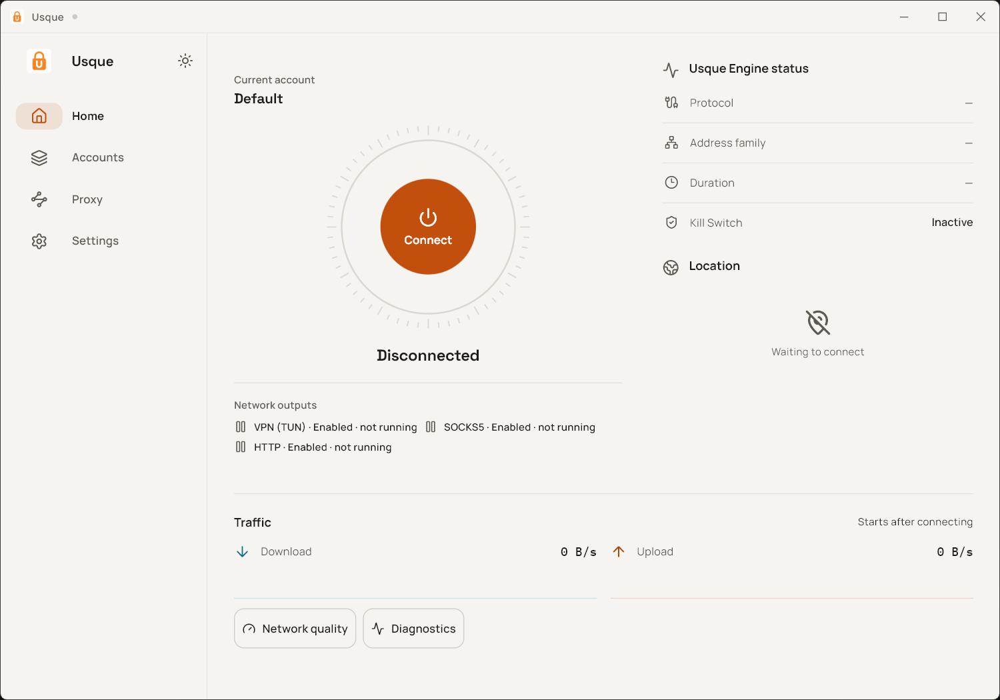

# В данном форке:
- заменена используемая для регистрации ссылка на API на незабаненную ссылку на API для Zero Trust.
# Возможные адреса эндпоинтов:
162.159.198.\*, 162.159.199.\* - для обычных пользователей 
162.159.197.\* - доступен только с Zero Trust 
\* заменяем на: 
- число 0 или число от 3 до 255 - только MASQUE h2 (TCP) 
- число 1 - только MASQUE h3 (UDP) 
- число 2 - MASQUE h3 (UDP) или MASQUE h2 (TCP) 

На адресах 162.159.198.\* и 162.159.199.\* возможны разные колокации, например: 
162.159.198.\* - colo=HEL (аэропорт Хельсинки)  
162.159.199.\* - colo=LED (аэропорт Пулково, Санкт-Петербург)

Некоторые SNI на замену speed.cloudflare.com, которые на протоколе MASQUE h3 (TCP) работают не только с портами 443 и 8443, но и с портами 500, 1701, 4500, 4443 и 8095: 
2gis.ru, apteka.ru, autonews.ru, beeline.ru, deepseek.com, mail.ru, max.ru, pochta.ru, profi.ru, psbank.ru, pypi.org, rt.ru, rutube.ru, sberbank.ru, vk.ru

  

  <a href="README.zh-CN.md">简体中文</a>

  
  
  
  
  
  
  
  

# Usque

Usque is an unofficial GUI client for consumer Cloudflare WARP. Flutter draws the UI. A Rust engine handles MASQUE, CONNECT-IP, DNS, proxies, and connection state. There is no WebView.

> [!IMPORTANT]
> The current release is **v0.2.3**. Download official packages only from the [GitHub Releases page](https://github.com/GeorgeXie2333/usque-app/releases). Pull Request artifacts, local builds, and untagged binaries are not official.

Usque is an independent project. It is not affiliated with, sponsored by, or endorsed by Cloudflare. Cloudflare and WARP are trademarks of Cloudflare, Inc. Use of consumer WARP remains subject to Cloudflare's terms and privacy policy.

## Screenshots

<table>
  <tr>
    <td align="center" valign="top">
      
<strong>Windows</strong>

      
    </td>
    <td align="center" valign="top">
      
<strong>Android</strong>

      
    </td>
  </tr>
</table>

## Release targets

The `v0.2.3` tag on `main` builds and checks these six packages:

| Platform | Package | Minimum OS | Architecture |
| --- | --- | --- | --- |
| Windows | MSI | Windows 10 22H2, build 19045 | x64-v2 |
| Windows | MSI | Windows 10 22H2, build 19045 | ARM64 |
| Android / Android TV | per-ABI APK | Android 8.0, API 26 | ARMv8 (`arm64-v8a`) |
| Android / Android TV | per-ABI APK | Android 8.0, API 26 | x64 (`x86_64`) |
| Android / Android TV | per-ABI APK | Android 8.0, API 26 | ARMv7 (`armeabi-v7a`) |
| Android / Android TV | universal APK | Android 8.0, API 26 | all three Android ABIs |

macOS source is in the tree but is not built or released. This release does not include iOS, production-supported Zero Trust, store listings, a public CLI, or multipath bandwidth aggregation. Source builds expose an experimental, release-gated Zero Trust organization enrollment described below.

## Highlights

- Consumer WARP registration, WARP License Key registration, and confirmed Consumer WARP Secret export.
- Experimental Cloudflare Zero Trust device enrollment on Windows and Android, limited to using an organization identity with the existing MASQUE Internet tunnel.
- VPN, SOCKS5, HTTP proxy, and Windows system proxy can run together on one MASQUE channel.
- HTTP/3 over QUIC, falling back to HTTP/2 over TLS, with IPv4/IPv6 Happy Eyeballs for the physical path.
- Full-tunnel VPN, tunneled DNS, Kill Switch, LAN access, and custom CIDR bypass rules.
- Optional country-based direct routing with separately downloaded per-country GeoIP data and one verified global V2Fly GeoSite catalog. SOCKS5/HTTP, Android VPN, and Windows TUN classify GeoSite names before DNS and use GeoIP when no QNAME is available; unknown destinations stay on MASQUE.
- SOCKS5 TCP/UDP and HTTP CONNECT/forward; listeners default to loopback.
- Several profiles, one active at a time, with identity stored per profile.
- Android per-app proxy (include-only): when off, every app uses the VPN; when on, only selected apps do. Newly installed apps stay off the tunnel until selected.
- Android Quick Settings tile, launcher shortcuts, boot recovery, and TV navigation.
- Windows tray, single-instance activation, start on boot, and close-to-tray.
- Local redacted diagnostics. No analytics, telemetry, or automatic upload.

Choosing an IPv4 or IPv6 MASQUE endpoint only picks the physical ingress. Either path can carry IPv4 and IPv6 inside CONNECT-IP. Usque keeps one active transport; it does not add bandwidth across paths.

When direct-country routing is enabled, GeoSite-matched domain queries use the DNS servers of the selected physical network and are visible to that DNS provider. Other domain queries keep using the configured WARP DNS through MASQUE. Applications using DoH or DoT hide the QNAME from Usque, so those flows can only be classified by GeoIP. GEO rule downloads are allowed while disconnected, but never bypass Android Lockdown or a surviving Windows Kill Switch.

## Default network settings

| Setting | Default |
| --- | --- |
| Endpoint IPv4 | `162.159.198.2` |
| Endpoint IPv6 | `2606:4700:103::2` |
| Port | `443` |
| SNI | `speed.cloudflare.com` |
| Transport | Auto: HTTP/3, then HTTP/2 |
| MTU | `1280` |
| Fallback DNS | `1.1.1.1`, `2606:4700:4700::1111` |
| SOCKS5 | `127.0.0.1:1080`, `[::1]:1080` |
| HTTP Proxy | `127.0.0.1:8080`, `[::1]:8080` |

These values can be changed and reset. A non-loopback proxy listener has no password and always shows a warning.

## Availability and installation

Download Usque from the [GitHub Releases page](https://github.com/GeorgeXie2333/usque-app/releases). Prefer the APK that matches the device ABI. The universal APK includes ARMv8, x64, and ARMv7 libraries and is larger; use it when the architecture is unknown. GitHub shows a SHA-256 for each asset; compare that digest and the published signer fingerprint before installing.

- Pre-1.0 Windows packages use a fixed self-signed identity. Check the published SHA-256 and certificate fingerprint before accepting the OS warning.
- Pre-1.0 Android packages use a project-controlled self-signed certificate and are not on Google Play. The package name `io.github.georgexie2333.usque` and current official release certificate are registered through [Android developer verification](https://developer.android.com/developer-verification). This registration verifies developer identity and signing-key ownership; it is not Google Play distribution or an app-content review, and manual installation or ADB may still be required.
- A later v1.0.0 signing change will be its own release.
- The release workflow compiles and signs the six packages, then attaches them with `release-manifest.json`, `SHA256SUMS`, and per-package SPDX SBOMs. Protected Windows, Android, network-observer, and performance-lab runs are optional supplemental validation; missing or failed protected runs never count as passed and do not block publication. Restricted captures and raw lab evidence remain CI-only.
- Usque checks once after each process startup when automatic checks are enabled. A verified stable release can be downloaded only after confirmation; Windows hands it to a signed passive updater and Android opens the system package installer. Manual checks always fetch live release data.
- Windows uninstall asks for confirmation in Settings, restores Usque-owned network state, and can delete the current user's local data if you ask.

See [Installation and removal](docs/INSTALLATION.md) for verification, upgrades, uninstall, and recovery.

## Outputs

One profile can enable several outputs. They share one pinned MASQUE transport and a packet multiplexer.

| Output | Behavior |
| --- | --- |
| VPN/TUN | Creates a system tunnel and manages routes, DNS, and Kill Switch rules. |
| SOCKS5 | TCP and UDP; remote DNS by default. |
| HTTP Proxy | CONNECT and ordinary HTTP forwarding. |
| Windows system proxy | Needs HTTP output; points Windows at the local listener. |

Windows defaults to VPN/TUN + SOCKS5 + HTTP, with the system proxy off. Android defaults to VPN + SOCKS5 + HTTP. Per-app proxy is an Android app setting, not part of a Profile: when it is on, only selected apps use the VPN. You can turn every output off and leave only the transport up.

## Security and privacy

- Endpoint pinning is always on. The GUI has no insecure TLS mode.
- Secrets, private keys, tokens, device identifiers, licenses, and endpoint pins go in Windows Credential Manager or Android Keystore.
- Secret export is explicit, confirmed, and written only to a path you pick.
- The Windows engine runs unprivileged. A small Agent owns TUN, routes, DNS, firewall, and system-proxy state.
- Android uses `VpnService` and an isolated `:vpn` process.
- Logs default to INFO and stop at 7 days or 20 MiB.

Read [SECURITY.md](SECURITY.md) before reporting a vulnerability. Do not put credentials or raw diagnostics in a public Issue. Official package signatures are described in the [code signing policy](docs/CODE_SIGNING.md).

## Build and contribute

The tree pins Rust `1.97.1`, Flutter `3.44.7`, Android NDK `29.0.14206865`, and the packaging tools. [CONTRIBUTING.md](CONTRIBUTING.md) has setup, checks, safety limits, and pull request rules.

Progress is in [Implementation](docs/IMPLEMENTATION.md). The experimental scope and live-tenant release gate are in [Zero Trust experimental support](docs/ZERO_TRUST_EXPERIMENTAL.md). Signing and the release workflow are in [Release process](docs/RELEASE.md).

## Upstream and license

Protocol behavior follows [Diniboy1123/usque](https://github.com/Diniboy1123/usque). This repository keeps a snapshot of that client in `oracle/go` for interoperability tests. The Flutter UI and Rust engine are new code. Upstream copyright stays in the license.

Source is [MIT](LICENSE.md). Third-party components keep their own licenses.
