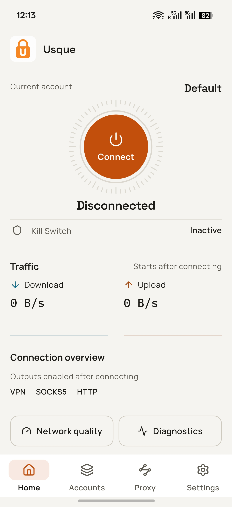

  

  <a href="README.md">English</a>

  
  
  
  

# Usque

Usque 是面向 Windows 和 Android / Android TV 的非官方 Cloudflare WARP 客户端。它将系统 VPN、SOCKS5 和 HTTP 代理整合在原生 Flutter 界面中，由 Rust MASQUE 引擎提供网络能力，不使用 WebView。

> [!IMPORTANT]
> 请仅从 [GitHub Releases](https://github.com/GeorgeXie2333/usque-app/releases) 下载正式安装包。Pull Request 构建、本地构建及未打标签的二进制均非正式发布。开发分支文档可能包含尚未发布的改动；请以安装包对应的发布说明和标签下文档为准。

Usque 为独立项目，与 Cloudflare 无隶属、赞助或背书关系。Cloudflare 与 WARP 是 Cloudflare, Inc. 的商标。使用个人版 WARP 仍须遵守 Cloudflare 的适用条款与隐私政策。

## 界面展示

<table>
  <tr>
    <td align="center" valign="top">
      
<strong>Windows</strong>

      
    </td>
    <td align="center" valign="top">
      
<strong>Android</strong>

      
    </td>
  </tr>
</table>

## 下载与安装

本次发布目标为 **v0.2.6**，是面向 Windows 和 Android 的功能与可靠性版本；对应标签工作流生成六个面向用户的安装包，以及两个仅供自动更新使用的 Windows MSI 载荷：

| 平台 | 最低系统 | 安装包 |
| --- | --- | --- |
| Windows | Windows 10 22H2，Build 19045 | x64-v2 安装程序 EXE 或 ARM64 安装程序 EXE |
| Android / Android TV | Android 8.0，API 26 | arm64-v8a、x86_64 或 armeabi-v7a APK |
| Android / Android TV | Android 8.0，API 26 | 包含上述三种 ABI 的通用 APK |

请选择与设备架构匹配的安装包。无法确定 Android ABI 时，可使用体积更大的通用 APK。安装前，将软件包 SHA-256 与 `SHA256SUMS` 及 GitHub 显示的资源摘要比对，再核验发布说明中的签名者指纹。任何一项不一致都应停止安装。

1.0 之前的安装包使用项目自行管理的固定自签名证书。Windows 可能显示“未知发布者”警告；Android 安装包不通过 Google Play 分发。不要通过关闭杀毒软件、防火墙或导入非官方安装包提供的证书来绕过警告。

升级、卸载、恢复及 Android 开发者验证说明见[安装指南](docs/INSTALLATION.md)，官方签名身份见[代码签名策略](docs/CODE_SIGNING.md)。更新下载需要用户确认，安装通过平台安装程序完成，不会无人值守地自动安装。

## 首次连接

1. 安装已核验的正式包并打开 Usque。
2. 完成首次启动的权限与条款步骤。注册个人版 WARP 身份，也可选择使用 WARP License Key 注册。目前不支持新导入 WARP Secret。
3. 选择需要的输出，在主页连接。Android 首次启用 VPN 输出时会请求 VPN 授权；仅使用 SOCKS5 / HTTP 时无需此授权。

| 输出 | 用途 |
| --- | --- |
| VPN/TUN | 将系统流量送入隧道，并遵循绕过规则和 Android 分应用设置。 |
| SOCKS5 | 提供本地 TCP/UDP 代理，默认使用远程 DNS。 |
| HTTP 代理 | 提供 HTTP CONNECT 和普通 HTTP 转发。 |
| Windows 系统代理 | 将 Windows 指向本地 HTTP 监听地址，需启用 HTTP 输出。 |

两个平台均默认启用 VPN、SOCKS5 和 HTTP；Windows 系统代理默认关闭。各输出共享一条 MASQUE 传输，可同时使用；关闭全部输出时只保留传输。身份材料按账户独立存储，同一时间仅一个账户活动；网络设置由所有账户共享。

## 主要功能

- 可选启用[实验性 L4 代理模式](docs/L4_PROXY.md)：通过 H3 上的 TCP CONNECT 支持 SOCKS5、HTTP 及 Windows/Android TUN，提供 DNS 转换，并根据身份派生 Consumer/Zero Trust SNI。Auto 模式仍不包含 L4。

- 个人版 WARP 账户、可选的 License Key 注册，以及经明确确认后导出到指定文件的 Secret。导出不代表 Usque 提供重新导入或恢复流程。
- 自动选择 HTTP/3（QUIC），并支持 HTTP/2（TLS）回退和物理路径的 IPv4/IPv6 Happy Eyeballs。H3 支持同地址族路径迁移及外层路径 PMTU 自动探测。
- 全隧道 VPN、隧道内 DNS、Kill Switch、局域网访问和自定义 CIDR 绕过规则。
- 可选的按国家直连：单独下载各国 GeoIP 数据和一份经过校验的全局 V2Fly GeoSite 目录。有域名时使用 GeoSite，无法看到域名时使用 GeoIP；未知目标仍走 MASQUE。
- 本地网络质量中心展示 RTT、丢包可用性、队列、PMTU、迁移、直连 DNS 和 60 秒趋势。Network Doctor 提供只读的 Standard 检查及需明确授权的 Deep 检查。
- Windows 托盘、单实例、开机启动和关闭后最小化到托盘；Android 快捷设置磁贴、启动器快捷方式、开机恢复和电视导航。支持 21 种语言，以及浅色、深色主题。

Android 分应用代理是应用级的“仅包含所选应用”设置，不属于某个账户。关闭时全部应用走 VPN；开启后仅勾选的应用走隧道，新安装的应用需手动勾选。启用 Android 的“阻止未使用 VPN 的连接”后，未勾选的应用会被阻断，而不是绕过隧道。

## 隐私与限制

- 端点固定是强制策略，不提供不安全的 TLS 模式。身份材料保存在 Windows 凭据管理器或 Android Keystore 中。Windows 界面与引擎以非特权方式运行，由独立 Agent 管理特权网络状态；Android 使用独立的 `:vpn` 进程。
- 代理默认仅监听回环地址。非回环监听没有认证，并会显示警告。仅代理模式不提供系统级 VPN Kill Switch。
- 诊断仅在本地生成并脱敏，不进行统计分析或自动上传；质量历史只保留在内存中。日志默认为 INFO，最多保留 7 天或 20 MiB。不要将凭据或原始诊断包放入公开 Issue；漏洞请通过 [SECURITY.md](SECURITY.md) 私密报告。
- Android 应用内 Kill Switch 无法在 VPN 进程被杀死后继续提供保护。此场景需同时启用系统“始终开启的 VPN”和“阻止未使用 VPN 的连接”，详见 [Android 安装说明](docs/INSTALLATION.md#android-and-android-tv)。

按国家直连的 DNS 可明确选择 **System**（默认）、**DoH** 或 **DoT**。System 会将匹配域名暴露给物理 DNS 提供商；DoH/DoT 则使用数字 IP 引导和严格 TLS，将查询发送给指定的加密解析器，失败不回退到明文。其他 VPN 查询继续通过 WARP DNS；代理 DNS 设置保持独立。应用自行建立的加密 DNS 会隐藏域名，此时使用 GeoIP 分类。断开连接时，规则下载仍遵循 Android Lockdown 和残留的 Windows Kill Switch。详见[直连 DNS](docs/encrypted-direct-dns.md)。

Usque 同一时间只选择一种数据面，不聚合多路径带宽。L4 在收到 GOAWAY 后，可能短暂保留一个用于完成已有流的旧 QUIC 会话。任一物理入口地址族均可在 CONNECT-IP 内承载 IPv4 和 IPv6。迁移仅限同地址族；自动 PMTU 不会提高配置的 TUN MTU，H2 的丢包率和 PMTU 显示 N/A。Doctor 结果不能证明外部观察到的零泄漏或实测性能提升。受保护环境验证不是发布前提，但缺失或失败的证据绝不计为通过。

Zero Trust 注册仍属**实验性功能**，仅用于以组织身份使用现有 MASQUE 公网隧道，不代表生产级 Cloudflare One Client 兼容。使用前请阅读[支持范围与验证要求](docs/ZERO_TRUST_EXPERIMENTAL.md)。仓库保留 macOS 源码，但不构建或发布；当前发布范围也不包括 iOS、应用商店分发或公开命令行。

## 默认网络设置

| 设置 | 默认值 |
| --- | --- |
| 个人版端点 IPv4 | `162.159.198.2` |
| 个人版端点 IPv6 | `2606:4700:103::2` |
| 端口 / SNI | `443` / `speed.cloudflare.com` |
| 传输 | 自动：先 HTTP/3，再 HTTP/2 |
| HTTP/3 拥塞控制 | `cubic`；可选择 BBRv2、实验性 BBRv3 和 `reno` |
| QUIC UDP 接收缓冲 | Windows/Android 的 H3、L4 均以 [2 MiB 为目标](docs/UDP_RECEIVE_BUFFER.md)申请；实际容量由系统决定 |
| TUN MTU | `1280` |
| 备用 DNS | `1.1.1.1`、`2606:4700:4700::1111` |
| SOCKS5 | `127.0.0.1:1080`、`[::1]:1080` |
| HTTP 代理 | `127.0.0.1:8080`、`[::1]:8080` |

代理地址、端口和 DNS 的编辑在应用前只是草稿；高级设置中的重置只把默认值加载到草稿，不会立即应用。Zero Trust 端点地址由注册返回，不可编辑。

拥塞控制的更改会保存，并在下一次手动连接或重试时生效，不影响当前会话及其自动重连。HTTP/2 使用系统 TCP。详见 [HTTP/3 拥塞控制](docs/congestion-control.md)。

## 文档与开发

从[文档索引](docs/README.md)选择需要的内容。技术文档目前以英文为主。

| 需要了解 | 阅读文档 |
| --- | --- |
| 安装、更新、卸载与恢复 | [安装指南](docs/INSTALLATION.md) |
| 本地网络质量检查 | [Network Doctor](docs/network-doctor.md) |
| 安全地构建和测试改动 | [贡献指南](CONTRIBUTING.md) |
| 实现与验证状态 | [实现进度](docs/IMPLEMENTATION.md) |
| 维护正式发布 | [发布流程](docs/RELEASE.md) |

请遵循贡献指南中的固定工具链和按改动范围划分的检查。仅编译构建和确定性测试可在开发机进行；安装开发包或测试 VPN 生命周期必须使用规定的隔离环境。构建成功不等于完成安装、泄漏或性能验证。

## 上游与许可

协议与行为参考 [Diniboy1123/usque](https://github.com/Diniboy1123/usque)。本仓库在 `oracle/go` 中保存一份快照，供互操作测试使用。Flutter 界面与 Rust 引擎为本项目新实现。上游版权声明见许可证。

源码采用 [MIT License](LICENSE.md)，第三方组件保留各自许可证。
