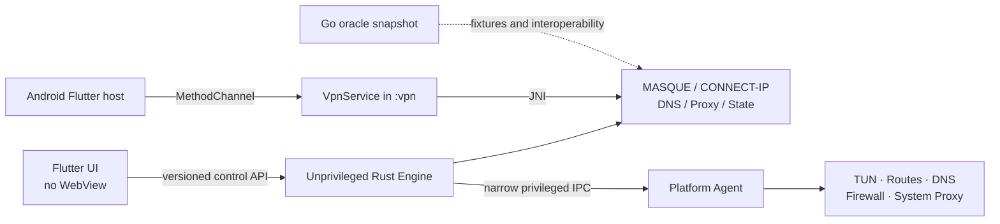

# Usque implementation progress

This is the Windows and Android / Android TV checklist. macOS source is kept for later work and is not built, packaged, or tested for the current release.

A checked item means the code is in the tree and its current automated tests pass. An unchecked item is unfinished, or only valid in an isolated environment that CI does not run.

## Architecture

Desktop UI and engine remain unprivileged. The desktop agent accepts only versioned, authenticated operations for TUN, routes, DNS, firewall state, and system proxy state. Android hosts the Rust `cdylib` inside the dedicated `:vpn` process.

## Milestone 1 — repository and contracts

- [x] Move the upstream Go CLI unchanged to `oracle/go`.
- [x] Create the Rust workspace and Flutter platform hosts.
- [x] Pin Rust and Flutter versions, Cargo/Flutter/Gradle dependency lockfiles,
  the Gradle distribution checksum, and Gradle artifact verification metadata.
- [x] Define `usque.v1` protobuf requests, responses, events, and structured errors.
- [x] Add bounded incremental protobuf framing and checked-in v1 wire snapshots.
- [x] Implement versioned profile defaults, validation, forward migration backup, and atomic JSON replacement.
- [x] Implement the fixed connection-state transition guard.
- [x] Add English/Chinese README, security policy, attribution, and reproducible brand-asset generation.
- [x] Freeze sanitized Go-oracle defaults, H2 request, and capsule fixtures and enforce them in Rust tests.
- [ ] Freeze independently reviewed, sanitized Go-oracle packet captures from controlled interoperability tests.
- [x] Add protobuf backwards-compatibility snapshots, including identity provisioning.

## Milestone 2 — Rust network core

- [x] Encode/decode QUIC variable integers and CONNECT-IP datagram context IDs.
- [x] Implement Auto transport orchestration with H3-to-H2 fallback decisions.
- [x] Implement IPv4/IPv6 Happy Eyeballs scheduling with one winning physical
  endpoint path while keeping CONNECT-IP payload IPv4/IPv6 independent.
- [x] Model strict endpoint-pin requirements and structured failures.
- [x] Implement IP.SB dual-stack and geo-location probing interfaces.
- [x] Add log redaction for secret fields and values.
- [x] Implement Consumer WARP registration, WARP License Key registration, and manual Secret parsing with zeroized temporary buffers.
- [x] Add experimental Zero Trust Access callback exchange, secure provider metadata plus a non-secret profile binding, registered endpoint discovery, and rollback-safe profile commits.
- [x] Port the Abobo7 P-256 Endpoint Pin semantics and authenticated one-shot refresh.
- [x] Implement bounded RFC 9484 ADDRESS_ASSIGN, ADDRESS_REQUEST, and ROUTE_ADVERTISEMENT codecs.
- [x] Implement the engine-side protobuf control service and serialized, atomic Profile CRUD.
- [x] Implement the pinned HTTP/3 + QUIC data path with `quiche`, CUBIC, pacing, and CONNECT-IP datagrams.
- [x] Interoperate with the live service through forced-H3 and Auto SOCKS5 TCP smoke tests without TUN.
- [ ] Harden H3 flow control, cancellation, reconnect, probe, and hostile-network behavior for release.
- [x] Implement the pinned production HTTP/2 + TCP + TLS tunnel with `h2` and BoringSSL.
- [x] Apply RFC 9484 ADDRESS_ASSIGN / ROUTE_ADVERTISEMENT on the HTTP/2 CONNECT-IP request stream with the same userspace peer-network state as HTTP/3; reject ADDRESS_REQUEST with unspecified ADDRESS_ASSIGN.
- [x] Apply peer address/route replacements as fail-closed full-tunnel policy,
  degrade withdrawn families, and generate/process required ICMP errors.
- [x] Implement tunnel DNS for the SOCKS5 TCP data path.
- [x] Apply default or user-configured VPN DNS on Windows and Android, filter
  single-family plans, and reject system/LAN/CIDR/endpoint DNS leak paths.
- [x] Implement SOCKS5 TCP.
- [x] Implement SOCKS5 UDP ASSOCIATE with tunnel-only forwarding, source binding, and idle cleanup.
- [x] Interoperate SOCKS5 TCP and UDP over forced H3 and forced H2 live paths without TUN.
- [x] Implement HTTP CONNECT and ordinary Forward with bounded parsing and strict body framing.
- [x] Interoperate HTTP CONNECT and Forward over forced H3 and forced H2 live paths without TUN.
- [x] Download bounded GEO rule data from allowlisted jsDelivr paths, verify per-country GeoIP and the global V2Fly `dlc.dat` checksum/content, atomically retain the last valid cache, and load immutable fail-closed classifiers.
- [x] Route selected SOCKS5 TCP/UDP and HTTP destinations over protected direct sockets, using GeoSite for hostnames and GeoIP for literals, with MASQUE fallback on direct setup failure.
- [x] Replace fixed 64 KiB proxy TCP windows with bounded preferred/fallback tiers,
  CUBIC, disabled Nagle, 128 KiB bidirectional relays, and a 1024-packet pipe.
- [x] Reuse up to two idle HTTP/1.1 upstream connections per authority within each
  local client session, with a 32-connection cap, 90-second expiry, and one safe
  bodyless retry after a stale keep-alive connection.
- [x] Emit redacted proxy memory-tier and HTTP-pool counters into local diagnostics.
- [ ] Gate `smoltcp` against the Go oracle performance and compatibility thresholds.
- [x] Add jittered ten-minute H3 recovery probes after an H2 fallback and atomically retain only one active channel.

## Milestone 3 — platform slices

### Windows

- [x] Current-user SID-scoped Named Pipe ACL and bounded protobuf server.
- [x] Connect the Flutter Windows host to the Named Pipe client, sidecar lifecycle, Profile sync, and Active Profile selection.
- [x] Stream snapshots and capability events over an independent user-scoped Named Pipe into Flutter `EventChannel`; remove Windows UI polling.
- [x] Narrow Windows service/agent IPC with SID, executable-path, and Authenticode signer checks.
- [x] Implement Wintun session ownership, shared-memory packet rings, endpoint bypass, dual-stack route/DNS plans, and a write-ahead cleanup journal.
- [x] Implement a persistent Windows Filtering Platform Kill Switch and fail-closed Agent/Engine reattachment after either process restarts.
- [x] Add Agent protocol v3 physical-DNS snapshots and reference-counted, pipe-leased exact WFP permits so Windows TUN can route GeoSite/GeoIP hits directly without a broad Engine egress rule.
- [x] Run bounded UDP/TCP Split DNS at `198.18.0.1` / `fd00::1`, classify QNAME before upstream selection, retry truncated UDP over TCP, and cache only question-reachable A/AAAA hints.
- [x] Credential Manager vault backend for all identity record types.
- [x] Export a saved Secret only after explicit confirmation to a user-selected destination, without revealing it in the UI or diagnostics.
- [x] Implement transactional system-proxy snapshot, apply, and crash/uninstall recovery.
- [x] Add WiX 5 MSI authoring, a selectable and upgrade-persistent install
  directory, a default-off current-user data purge choice, exact
  Wintun/signature validation, Agent service installation, and fatal
  uninstall/upgrade recovery sequencing.
- [x] Remove crash-surviving Usque Wintun devices by journaled name/GUID/LUID,
  distinguish true uninstall from major upgrade, and delete only proven-clean
  machine recovery state before MSI removes the Agent binary.
- [x] Signed x64-v2 and ARM64 MSI packaging.
- [ ] Isolated clean-install, upgrade, and uninstall validation.

### Android and Android TV

- [x] API 26 minimum, TV Leanback entry, and non-touchscreen compatibility.
- [x] Dedicated `:vpn` process, `VpnService`, foreground notification, control Binder, and JNI boundary.
- [x] Fail closed before creating the VPN if the Rust data channel is unavailable.
- [x] Wire arm64-v8a, x86_64, and armeabi-v7a Rust targets into the Gradle release build and produce a universal APK.
- [x] Transfer connection snapshots from `:vpn` to the UI over a bounded-time Binder request.
- [x] Validate manually entered WARP Secrets in Rust before encrypting them with Android Keystore.
- [x] Stream native events/counters from `:vpn` through Binder callbacks and Flutter `EventChannel`.
- [x] Automatic Consumer registration through Rust before Android Keystore persistence.
- [x] Export a saved Secret through Android SAF after explicit confirmation, without revealing it in the UI or diagnostics.
- [x] Implement `VpnService.Builder` address/DNS setup, API 26–32 CIDR complements, API 33+ exclusions, a 256-route ceiling, retained TUN reconnects, `protect(fd)`, and underlying-network rebinding.
- [x] Terminate GeoIP- or GeoSite-hint-selected Android TUN TCP/UDP flows in a bounded userspace gateway and relay them through protected sockets bound to the selected physical network.
- [x] Snapshot Android `LinkProperties.dnsServers`, publish internal Split DNS routes, and fail VPN startup if a valid physical DNS path is unavailable.
- [x] Add device-scoped Android per-app proxy (include-only `addAllowedApplication`) stored in app settings, not the Profile.
- [x] Fail-closed Android reconnect: retain the TUN fd when Kill Switch is armed and the address/DNS/MTU/route identity is unchanged; establish a replacement TUN before closing the old one when that identity changes.
- [x] Expose Android start-on-boot, Quick Settings tile request, and a deep link to system Always-on VPN settings.
- [ ] Sleep, network-switch, and TV lifecycle tests.

### macOS (deferred; not a current release gate)

- [x] Current-user Unix Socket permissions, peer-UID validation, and protobuf engine IPC.
- [x] Connect the Flutter macOS host to the Unix Socket client and sidecar lifecycle.
- [ ] Minimal launch daemon/helper and authorization flow.
- [ ] utun, route, resolver, PF Kill Switch, and recovery journal.
- [x] Keychain storage for all identity record types.
- [ ] LocalAuthentication re-authentication for reveal/copy/export operations.
- [ ] System proxy snapshot, apply, and crash/uninstall recovery.
- [ ] macOS 12+ Universal and macOS 10.15–11.7 Intel-compatible PKG packaging.

## Milestone 4 — Flutter UX

- [x] Responsive Home, Profiles, Proxy, Settings, Advanced, and Diagnostics/About pages.
- [x] Four-step permissions, terms, and Consumer WARP identity onboarding.
- [x] White/orange visual system, dark mode, and Lucide-only interface icons.
- [x] Exact default endpoints, SNI, MTU, DNS, listener addresses, and reset action.
- [x] Composable VPN/SOCKS5/HTTP outputs, Windows system-proxy dependency, and non-loopback listener warning.
- [x] Remote/custom/system Proxy DNS selection with dedicated IPv4/IPv6 servers and an explicit local-DNS leak warning.
- [x] Exit location, IPv4, IPv6, protocol, family, duration, and traffic UI.
- [x] English and Simplified Chinese string catalogs.
- [x] Adaptive desktop/mobile navigation and focusable Material controls.
- [x] Retain a bounded, corruption-safe one-time reader for the legacy Flutter Profile draft.
- [x] Make versioned Rust configuration the authoritative Profile store on Windows and Android, then remove the migrated Flutter draft.
- [x] Connect desktop and Android identity provisioning to their platform vaults.
- [x] Add Windows manual Zero Trust callback entry and an Android process-local, same-team, single-consumption protocol callback.
- [x] Add Windows clipboard fill, live Access-callback validation, optional current-user HKCU protocol association, and single-instance URI forwarding.
- [x] Keep identity plaintext hidden while supporting explicit, confirmed Secret export to a user-selected destination.
- [x] Add per-Profile output toggles, frontend status chips, shared-session totals, WARP License Key management, and platform quick actions.
- [x] Apply online output changes through a rollback-capable desktop reconnect or one controlled Android reconnect.
- [x] Keep the MASQUE session across SOCKS/HTTP listener changes, Windows system-proxy lease changes, and VPN attach/detach when GEO routing is disabled; reconnect when a mode-dependent GEO gateway must be rebuilt; advertise `hot_reconfigure`.
- [x] Surface real Kill Switch / Always-on / Lockdown state on Home and wire Retry to the existing control retry path.
- [x] Honor profile `auto_connect` once at process start (and Android boot when start-on-boot is also on).
- [x] Replace controlled reconnects with true no-drop frontend hot mutation while retaining the same MASQUE channel.
- [x] Fetch fixed-version `flag-icons` SVG through the active tunnel, validate it, cache it, and return SVG bytes to Flutter.
- [x] Add diagnostics content review plus Windows and Android native save pickers; exported bundles contain bounded sanitized summaries and logs.
- [x] Add manual and rate-limited automatic GitHub release checks without automatic installation.
- [x] Add the direct-country rule download/update/search panel, cached-state gating, partial-result feedback, and accessible enable controls.
- [x] Add privacy-filtered 7-day/20-MiB JSON log rotation on Windows and Android.
- [x] Add widget tests for Simplified Chinese dark mode at 200% scaling and Android TV D-pad navigation.
- [ ] Add deterministic pixel-golden coverage for every declared theme, locale, and viewport matrix.

## Milestone 5 — release hardening

- [x] Add an exact-candidate H3/H2 endpoint and independent IPv4, IPv6, DNS, Kill Switch, route, and direct-rule observer gate.
- [x] Add a protected Windows snapshot-VM matrix for clean install, upgrade, connected uninstall, Engine/Agent failure, sleep/network change, platform-state restoration, and Wintun residue.
- [x] Add a protected Android physical-device matrix for network changes, airplane mode, Doze, process reclamation, Always-on, Lockdown, reboot, upgrade, and TV lifecycle.
- [x] Add an optional controlled seven-sample performance baseline and protected evidence report without making runner availability a publication prerequisite.
- [ ] Define enforced throughput, latency, and memory thresholds versus the Go oracle (wish targets: throughput >= 90%, p95 latency regression <= 10%, memory <= 125%). The optional baseline records and validates evidence but does not encode these numeric acceptance targets.
- [x] Stable signing identities and published fingerprints.
- [x] The protected stable tag workflow builds every declared package from `main`.
- [x] SHA-256, SPDX SBOM attestations, provenance, commit, and certificate fingerprint.
- [ ] Expand clean-machine installation and removal coverage beyond the current protected matrix to every supported artifact and OS/architecture combination.

The release workflow fails if a Windows or Android artifact, signing input,
architecture check, required CI result, manifest, SBOM, attestation, protected
runner report, or matching evidence is missing, failed, `not_run`, or bound to
the wrong candidate. A local binary cannot replace a failed GitHub Actions
artifact. The current protected matrix is mandatory; broader per-artifact
clean-machine coverage and numeric Go-oracle performance thresholds remain open.

How the current stable tag is built and published is in [RELEASE.md](RELEASE.md).
