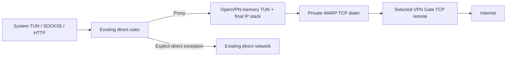

# WARP → VPN Gate

VPN Gate lets you choose a volunteer server as the final Internet exit on
Windows, Android and Android TV. Usque reaches that server through WARP.

## Set up an exit

1. Open **Proxy → VPN Gate** and turn on the VPN Gate switch. It is off by default.
2. Refresh the directory, filter by country and select a TCP server.
3. Save or apply the selection using the bottom bar. Selecting a row alone only
   edits a draft; it does not reconnect.
4. Check the live connection status to see which server is actually in use.

A terminal VPN Gate failure disconnects the whole chain. On Android, ordinary
network access resumes after the VPN ends unless system blocking is enabled.
To keep apps blocked, enable both **Always-on VPN** and **Block connections
without VPN** as described in [Android setup](INSTALLATION.md#keep-apps-blocked-when-the-vpn-ends).
Your explicit direct-routing exceptions continue to apply.
Server selection is available only while the page's VPN Gate switch is on.
With the switch off, the directory remains browsable and existing selections
are retained.

## Saved selection and current connection

The current connected server and the draft are separate. An enabled selection
is device-wide and shared across WARP accounts. A failed apply retains the
requested target and its error. A node disappearing from the directory does
not change its saved configuration or disconnect an existing session.

On wide layouts, VPN Gate stays inside the Proxy content area and the side
navigation remains available. Selecting Proxy again returns to its overview;
selecting another section leaves the subpage after its unsaved-change guard.
Compact layouts keep the full-screen subpage and system Back behavior. Resizing
preserves the subpage, draft, filters and scroll position. Connection status
describes the live session; the persistent bottom bar describes the saved or
pending selection and provides apply and configuration-preparation controls.
The Home page's **WARP → VPN Gate** title and connection phase open this same
settings subpage, with the Proxy navigation destination selected. This shortcut
does not save a selection or change the connection.

## Connection behavior

OpenVPN is an additional exit setting. WARP CONNECT-IP/L4 and HTTP/3/HTTP/2
remain independent choices. The selected OpenVPN TCP connection always uses
the WARP internal dialer, without Geo matching. There is no second OS VPN
interface, OpenVPN process, physical OpenVPN socket or public bootstrap proxy.
Business UDP uses IP packets inside OpenVPN TCP; HTTP retains its existing
HTTP/CONNECT semantics. TCP encapsulation can increase latency under loss.

The final IP addresses, DNS and MTU come from OpenVPN. WARP assignments stay
inside the underlay. Unsupported proxy address families are refused in the
final stack and TUN path. Explicit Geo, CIDR, LAN, system-proxy bypass and
Android application exceptions retain their direct behavior. User-configured
local/direct DNS is preserved; remote DNS and exit diagnostics use the final
session and never substitute the node's advertised IP for a measured exit.
In remote DNS mode, the OS uses the existing internal DNS listener and its host
route. This keeps a VPN-pushed private resolver inside the final channel even
when LAN bypass is enabled; Geo direct DNS exceptions still follow their rules.
With VPN Gate and tunnel DNS enabled, toggling the system VPN frontend rebuilds
the runtime so the internal DNS service matches the new platform configuration.
It reconnects the same saved Gate node; ordinary WARP and explicit local DNS
keep their existing frontend-switch behavior.

Traffic samples count packets entering and leaving the final VPN Gate channel.
RTT, loss, congestion and HTTP/QUIC diagnostics describe the underlying WARP
connection to Cloudflare; they do not measure the complete path through the
volunteer server. The network quality page labels this scope. Replacing either
the VPN Gate session or the active WARP transport starts a new sample history,
so counters from different sessions cannot form a traffic-rate interval.
WARP connection events remain available while VPN Gate is active.

A connected VPN Gate node providing only IPv4 shows connected when IPv4 is
available; unsupported proxied IPv6 stays blocked. Losing IPv6 from a dual-stack
assignment still shows limited connectivity, as does reduced family support
without VPN Gate.
Exit location and public addresses still depend on a successful final-channel
probe and may be unavailable during network fluctuations.
Across all WARP modes, with or without VPN Gate, each failed exit IP or location
lookup is retried once after one second. Successful lookups are retained; a
second failure leaves that information unavailable. Disconnecting or replacing
the probe cancels pending requests and retries for the old session.

## Directory and saved configuration

The mirror's [cumulative pool contract](https://github.com/GeorgeXie2333/vpngate-list-mirror/blob/main/docs/pool.md)
is validated in `usque-core::vpngate`. Discovery requests Raw
`main/pool/latest.json`, then races the five complete, validated CDN responses
at `cdn`, `fastly`, `gcore`, `testingcf` and `quantil.jsdelivr.net`, using
`@latest/pool/latest.json`. A fast invalid response cannot win.

The chosen index pins the complete data commit. Both `pool/servers.json` and
`pool/countries.json` must match their byte lengths, SHA-256 and schema, and
agree on countries, counts and source acquisition time before an atomic cache
switch. Country filters derive from that node snapshot. Older indexes cannot
replace a newer valid cache. A corrupt downloadable cache can be repaired by
a completely validated refresh without deleting favorites.

A Raw timeout disables Raw for the rest of that acquisition and its WARP
fallback. Lazy configuration requests inherit the selected snapshot's download
policy. A new directory refresh evaluates Raw again. All remaining requests
race the five CDN hosts at the fixed commit; only discovery uses `@latest`.
Other Raw errors enter CDN fallback without permanently disabling Raw. If a
primary acquisition fails, WARP retries once, retaining the already selected
index and completed files. Failures preserve the previous cache.

Connected refreshes and configuration downloads use the final session first
and reuse its WARP underlay for fallback. Offline fallback creates an
account-bound headless WARP session and releases it on completion or
cancellation. It creates no user listener, TUN or system proxy. Jobs cancel on
account/lifecycle changes. Each request has a five-second connection deadline
and a fifteen-second complete-response deadline. Redirects and system proxies
are disabled. Identity encoding is required. Limits are 64 KiB per index,
16 MiB per directory, 5,000 nodes, 256 KiB per configuration JSON and 128 KiB
per decoded OpenVPN configuration.

Configuration is fetched only for explicit save, favorite or favorite-update
operations. The configuration JSON and its decoded original Base64 content
have separate byte lengths and hashes. Both are checked before applying the
existing OpenVPN profile allowlist. A metadata TCP candidate is not a promise
of native compatibility or a successful VPN connection. Node jobs acknowledge
immediately and query in-memory progress without repeatedly parsing the pool;
neither IPC nor Kotlin sends
configuration bodies to Flutter. Saving settings only pins a prepared local
reference. The UI also checks account and connection intent before applying a
completed preparation, so a late result cannot undo Disconnect.

**All servers** and **Favorites** share the country filter and local flags.
All servers uses the cumulative pool with source score ordering; favorites use
descending saved time. The controls share a row when the content area is wide
enough and stack with explicit spacing at narrow widths or large text sizes.
Source scores, ping and speed are not local measurements. Workers' TCP
observations include their timestamps and do not establish OpenVPN, TLS or
application connectivity. Missing or untested nodes are not treated as proven
offline. The page marks observations older than twelve hours and source data
older than three or twenty-four hours. Local acquisition time and the mirror's
source acquisition time are displayed separately; neither is an upstream
update timestamp. Hourly foreground refreshes do not guarantee CDN freshness.

Server rows show relative observation times, updated once a minute while the
page is active. Absence from the latest source list has no separate label;
favorites removed from the server pool retain their listing-status label.
**Details** exposes
the first/last source appearance and TCP observation with full local timestamps;
hover hints are optional shortcuts, not the only way to read them. Summaries
wrap at narrow widths and large text sizes. Historical TCP success uses a
neutral style, and observations older than twelve hours are marked expired.
Details and favorite actions remain available when server selection is disabled
and do not change the pending selection.

Favorites are device-local and shared across WARP accounts. Each stable node ID
has one saved configuration snapshot, stored beside application configuration
(Android uses `noBackupFilesDir`), separately from the downloadable pool cache.
Configurations are deduplicated by content hash. Refresh, node disappearance
and ordinary cache cleanup do not delete favorites or replace their bytes.
New configurations are explicitly updated with an expected-old-hash check.
Membership revision checks prevent a removed favorite from being resurrected
by an old update. Limits are 5,000 favorites and 64 MiB of referenced local
configuration objects; favorites are never automatically evicted.

Removing a favorite does not disconnect or change the saved selection. Current
and prepared selections retain independent references. Updating or removing a
favorite also retains any pending local draft until it is saved or discarded.
Each configuration operation holds a separate temporary reference. Completing,
failing or cancelling a favorite operation releases only that reference; a
successful Prepare publishes the draft reference independently. Cancelling a
completed Prepare releases its draft, whereas cancelling a completed favorite
does not release a draft belonging to another operation.
Unreferenced objects are collected after membership/settings changes; startup
clears abandoned preparation references. Legacy inline saved selections remain
readable and migrate on demand; they are not automatically added to favorites.
The master switch must be on to select a server, while favorite management
remains available with it off. Current, saved and pending selections retain
their own node metadata and configuration hashes.

## Native implementation and verification

`usque-openvpn` embeds OpenVPN 3 Core 3.11.7 at
`18edfae7e7fd8051c93bd4746ec69be91eb02dbb`, C++17 and Mbed TLS 3.6.7. Its C ABI
exchanges bounded packets and typed events with a dedicated core thread.
Transport generation checks reject old callbacks. Native input and output are
each limited to 256 entries / 4 MiB; Rust IP channels have independent byte
budgets. TCP lengths are two-byte network-order frames, read/written with
partial-I/O handling. Cancellation stops producers and joins the core.

Cancellation includes awaits inside event handlers and the final transport
failure notification. Stop is signalled to the native core before joining the
transport task, and it wakes backpressured input writers. Native shutdown waits
at most five seconds. A timeout is reported as a pending worker: the worker
retains its native allocation until it exits, while its caller-owned transport
and final traffic admission are closed. This does not claim the native thread
was forcibly terminated. Each connection attempt has a 35-second negotiation
deadline, separate from the bounded shutdown wait.

After the desktop service finishes platform cleanup or records its recovery
failure, Engine runtime shutdown waits at most another five seconds for pending
blocking workers. This avoids Tokio's default unlimited shutdown wait. The UI
process monitor uses cancellable 100-millisecond waits and closes its process
handle when another shutdown trigger wins. These limits do not bypass Agent
cleanup or turn an incomplete recovery journal into Clean.

The profile allowlist permits only numeric TCP remotes matching the directory
IP and preserves the advertised port. UDP profiles are not rewritten. Scripts,
plugins, external file references, nested proxies, compression and peer
verification bypasses are rejected. The minimum TLS version is 1.2. CBC/SHA1
refers to the data channel; it does not disable TLS certificate verification.
The native TUN builder captures assignments and never executes pushed OS routes.

Mbed TLS authenticates the OpenVPN CA chain and configured OpenVPN certificate
constraints, rather than assuming an HTTPS DNS SAN for a numeric VPN remote.
Compatibility patches explicitly select CBC PKCS#7 padding and enforce TLS
version limits. The complete patch rationale is in
[the upstream patch record](../third_party/openvpn3-3.11.7/USQUE-PATCH.md).

## Lifecycle, cleanup and privacy

Final traffic is admitted only after negotiation and platform attachment.
When explicitly disabling VPN Gate, WARP frontend settings remain staged
through Android's replacement TUN handoff. Reconfiguration updates that pending
profile without admitting traffic; final activation starts its listeners only
after platform attachment. Cancellation discards the pending profile.
Android exit IP and Location probes always use the current final internal
network, including after disabling VPN Gate: Gate while enabled, WARP otherwise.
They do not rely on system TUN routing or local proxy listeners. Failed lookups
retain the existing single retry and never retry over the physical network;
session cancellation and Gate generation checks still reject obsolete results.
Switching closes old final flows, retains a usable WARP session, builds a new
OpenVPN session and applies its final assignment. No failure path intentionally
selects WARP or physical egress as the final fallback. A terminal VPN Gate
failure (during startup, a node switch, or an established session) disconnects
the whole chain, including WARP. The error and saved selection remain visible;
the next explicit connection starts a new WARP session. Protocol negotiation
may retry before reporting failure, but a failed session is never kept alive
for an in-place retry.

During connection setup, OpenVPN `AUTH_FAILED` gets one immediate internal
retry (two attempts total) against the same saved node and configuration.
The existing WARP session is reused. Each rejected OpenVPN worker and its TCP
stream must finish stopping before the next attempt starts; a pending worker
prevents a retry. The UI keeps showing connection setup without an intermediate
authentication error, retry indicator or reconnect count. Cancelling setup
also cancels these attempts. A second authentication failure, any certificate or
configuration failure, or an established-session authentication failure follows
the normal terminal disconnect path. Diagnostic logs retain only the internal
retry number and library event labels, not authentication contents.

Windows Agent owns the sole Wintun, route, DNS and WFP journal. Chain protection
is installed before final negotiation, including when the persistent Kill
Switch setting is off. Finalization changes only address/DNS/MTU fields; it
cannot change bootstrap endpoints or direct exceptions. The transition guard
is retained during ordinary node switches, and failure cleanup restores it
through the disconnect journal, including removal of this transaction's WFP
Kill Switch filters. Incomplete cleanup remains RecoveryRequired; it must not
claim that system networking has been fully restored.

An explicit cancellation during Prepared startup drops the headless startup
future (closing its producer guards) before releasing the startup pipe. A full
disconnect closes final admission and packet producers before releasing either
startup or active leases, then performs asynchronous teardown and rollback.
Terminal negotiation failures use the same disconnect cleanup. Finalization
also observes cancellation, so a stopped request cannot admit a late connection.
The Agent's existing EOF grace, operation/owner checks and lease epoch remain
authoritative; Prepared alone never authorizes recovery of a live transaction.

Windows retains the Agent-managed device across disconnects and node/account
switches, while each replacement session restores its own network receipts.
The independent device lease belongs to the Engine application lifetime;
startup/active packet leases still protect cancellation and reattachment.
Final device retirement happens after full application exit, and still requires
both interface and PnP absence. Failed or unknown probes remain pending.
See [device lifetime and recovery](RELIABILITY_TESTING.md#windows-wintun-device-and-connection-lifetimes)
for persistence, ownership and diagnostic limits.

Android uses its existing VpnService and a blocking interface during setup.
A new final interface is established and attached before retiring the old Java
descriptor. A rejected handoff closes final admission and stops WARP. A terminal
failure with VPN Gate enabled uses the complete disconnect path, including
startup, handoff and established-session failures. It invalidates old tasks,
removes the active recovery record, cancels the native runtime, closes Java's
TUN and ends this connection's Kill Switch protection. Native duplicate-FD and
worker cleanup remain tracked; an unconfirmed stop cannot claim completion.
The original error and selected node remain available for an explicit retry.
Outside Android Lockdown, ending the VPN restores ordinary network access.
Only WARP outer sockets and explicit direct traffic receive physical
socket protection. Always-on/Lockdown and process-death guarantees retain their
existing Android boundaries. In-process admission is not an independent OS
Kill Switch.

Directory hosts learn directory requests; the WARP provider carries the
OpenVPN connection; the selected volunteer provides final egress. Configurations
and public client key material stay in engine storage, not Flutter status,
free-form logs or diagnostics. Native logging and hardware identifiers are
suppressed. No new automatic telemetry or diagnostic upload is introduced.

## Sources, licenses and validation

OpenVPN Core uses MPL-2.0; Mbed TLS uses Apache-2.0; Asio uses BSL-1.0; LZ4
and xxHash use BSD-2-Clause. The selected sources and original license texts
are vendored. [The source lock](../tool/openvpn_sources.json) pins archives,
original file hashes and reviewed patch hashes. Run
`python tool/check_openvpn_sources.py`; it also verifies the license asset
available from the VPN Gate page. Release SPDX generation includes these native
packages, which Cargo/Gradle inventories alone do not discover.

Use the complete [change-scoped checks](../CONTRIBUTING.md). Native protocol
tests additionally run with `cargo test -p usque-openvpn --features interop-test
--locked` after initializing the supported Windows build environment. The
memory peer uses public test identities, TLS 1.2, CBC/SHA1, UDP-shaped IP packets,
rekeying and terminal authentication failures; it opens no OS sockets or TUN.
It is a Core-to-Core protocol test, not evidence of OpenVPN 2 server or public
volunteer availability. The feature is excluded from production builds.

The [local implementation validation record](VPN_GATE_VALIDATION.md) lists
completed commands, the blocked PowerShell check and isolated checks not run.

Real TUN, WFP, routes, leaks, crash recovery and Android device lifecycle must
be checked in the environments defined by [the development safety rules](../CONTRIBUTING.md#development-machines).
They are **not run on a development workstation**. The controlled exit matrix
must compare TUN/SOCKS5/HTTP traffic against the same selected VPN Gate session,
then independently exercise direct exceptions, unsupported IPv6, changed
assignments, WARP loss, Gate loss, node switching and explicit disconnect.
Record unavailable isolated validation as `not_run`. The shared validation and
publication rules are in [Contributing](../CONTRIBUTING.md#development-machines).
